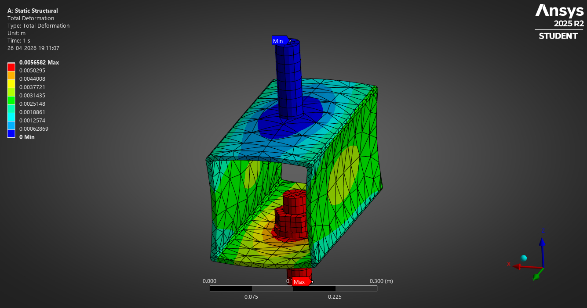

    <section id="one">
        

            <header class="major">
                <h2>Predicting Failure, Ensuring Performance</h2>
            </header>
            
From automotive components at high RPM to civil engineering failure analysis, my work focuses on using Ansys and SolidWorks to simulate real-world physics. I specialize in transient structural analysis where time-dependent loads determine the longevity of a design.

        

    </section>

    <section id="two" class="spotlights">
        <section>
            
            

                

                    <header class="major">
                        <h3>Transient Wheel Rim Analysis</h3>
                    </header>
                    
Simulating a 1500 RPM acceleration and braking cycle to study centrifugal stress distribution and safety factors using Aluminum 6061-T6.

                    <ul class="actions">
                        <li><a href="2026-04-18-transient-wheel-rim-analysis.html" class="button">Read Deep Dive</a></li>
                    </ul>
                

            

        </section>

        <section>
            
            

                

                    <header class="major">
                        <h3>Hyatt Regency Walkway Failure</h3>
                    </header>
                    
A forensic engineering simulation recreating the structural failure of the 1981 collapse to analyze shear stress on the hanger rod connections.

                    <ul class="actions">
                        <li><a href="hyatt-analysis.html" class="button">View Simulation</a></li>
                    </ul>
                

            

        </section>
    </section>

