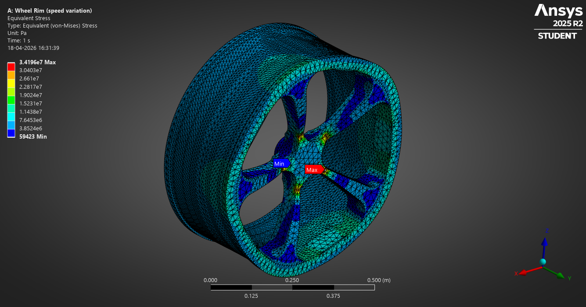

<section id="one" class="tiles">
    <article>
        
            
        
        <header class="major">
            <h3><a href="/fea-hub/" class="link">FEA Simulations</a></h3>
            
Structure & Failure Analysis

        </header>
    </article>

    <article>
        
            
        
        <header class="major">
            <h3><a href="/f1-data/" class="link">F1 Data Science</a></h3>
            
Telemetry Analysis using Python & FastF1

        </header>
    </article>

    <article>
        
            
        
        <header class="major">
            <h3><a href="/cad-robotics/" class="link">CAD & Robotics</a></h3>
            
Generative Design, nTop Implicit Modeling, and Combat Robotics

    </header>
</article>
</section>

<section id="two">
    

        <header class="major">
            <h2>The Desire to Optimize</h2>
        </header>
        
I am a first-year student at VIT focused on the intersection of mechanical design and high-performance computing. Whether it's a transient FEA run on a car rim or an F1 telemetry dashboard, I believe every system can be made faster, lighter, and more efficient.

        <ul class="actions">
            <li><a href="all_posts.html" class="button next">Read all posts</a></li>
        </ul>
    

</section>

